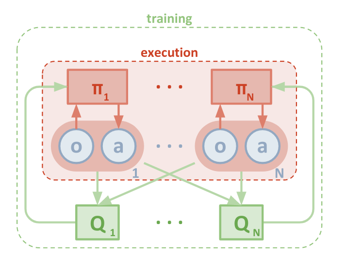
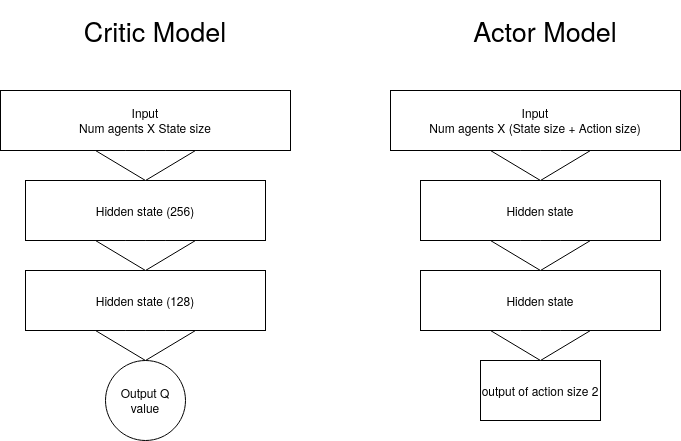
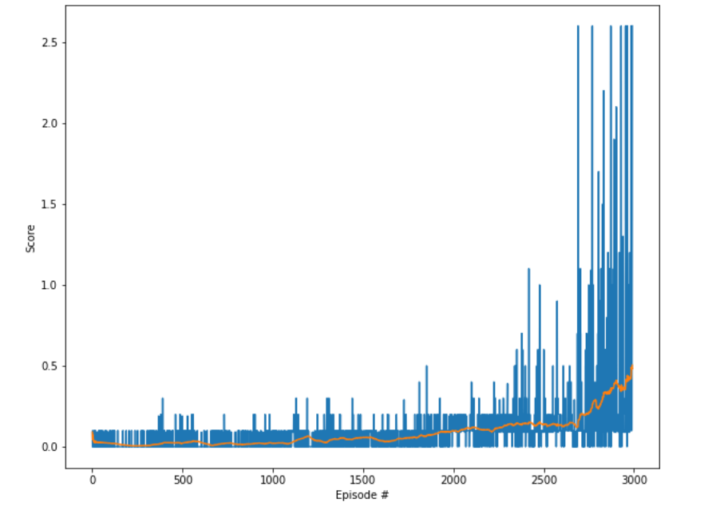

# Learning Algorithm

 - The code for DDPG was implemented with the help of udacity lecture material
 - Also referred ShagtongZhang Deep reinforcement learning library `https://github.com/ShangtongZhang/DeepRL` to debug my model


 The Idea is was to build a multi-agent DDPG model that teaches the agents to take necessary actions (using its corresponding  actors) while the individual critic models observe the entire observation state (appended) only in training phase.
 It also partially follows the [Paper](https://arxiv.org/pdf/1706.02275.pdf)



#### Model built chose consists of Actor and Critic for both the Tennis agents

## parameters and hyperparameter


- BUFFER_SIZE  # replay buffer size
- BATCH_SIZE # minibatch size
- GAMMA # discount factor
- TAU # for soft update of target parameters
- LR # learning rate 
- UPDATE_EVERY # how often to update the network


| Parameters               | value                    |
|--------------------------|--------------------------|
| Buffer size              | 1e5                      |
| batch size               | 128                      |
| GAMMA                    | 0.99                     |
| TAU                      | 5e-2                     |
| LR                       | 5e-4                     |
| Update every             | 4                        |
| Ornstein–Uhlenbeck Noise | decay every 250 episodes |

## Models used for agents

For Actor

```reStructuredText
Actor Net(
  (fc1): Linear(in_features=48, out_features=256, bias=True)
  (fc2): Linear(in_features=256, out_features=128, bias=True)
  (fc3): Linear(in_features=128, out_features=2, bias=True)
)
```

For Critic

```reStructuredText
Critic Net(
  (fc1): Linear(in_features=52, out_features=256, bias=True)
  (fc2): Linear(in_features=256, out_features=128, bias=True)
  (fc3): Linear(in_features=128, out_features=1, bias=True)
)
```

# Plots of Rewards



### Environment was solved in 2891 episodes! Average Score: 0.50

# Future works

- Will explore Soft Actor Critic (SAC) model that maximizes the entropy https://arxiv.org/pdf/1801.01290.pdf which is a promising alternative to DDPG
- Twin Delayed DDPG would be a simple extension 
- Ablation studies on the OU Noise 
- Try to solve the environment in few 100 episodes


```python

```
